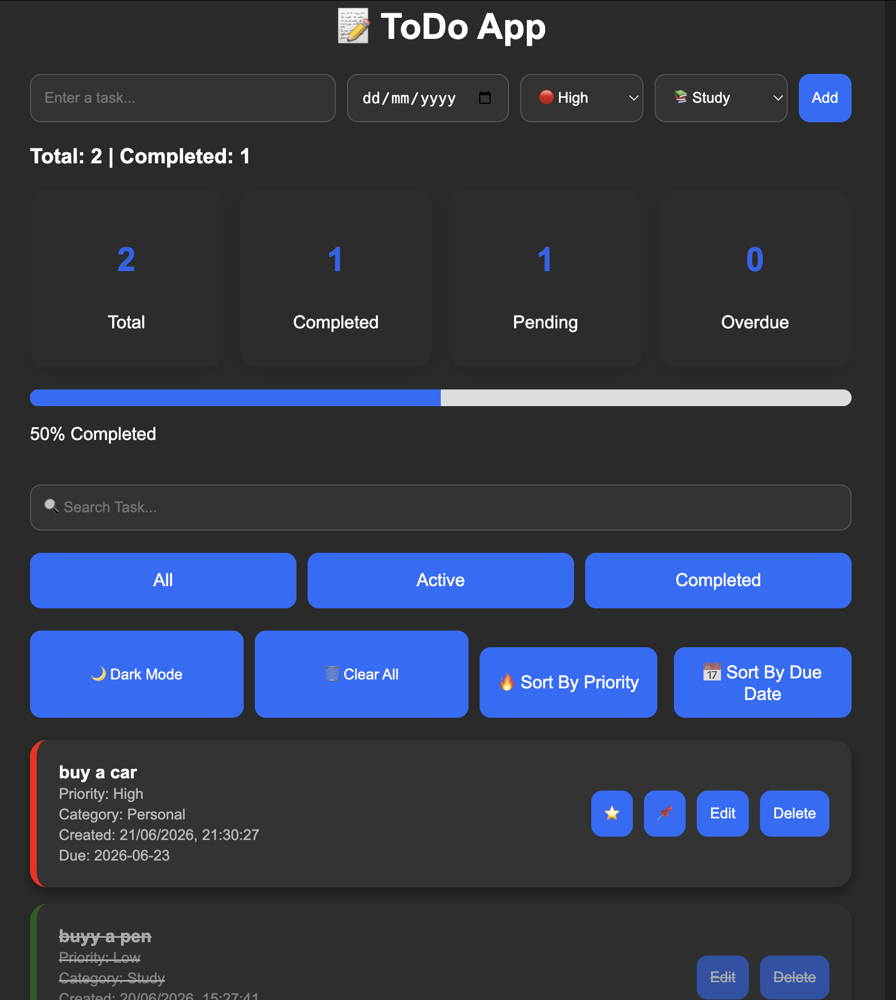

# 📝 ToDo App V7

## An advanced ToDo application built with HTML, CSS and JavaScript. It supports task management with priorities, categories, due dates, search, sorting, dark mode and local storage.

## ✨ Features
- ➕ Add Tasks
- ✏️ Edit Tasks
- 🗑️ Delete Tasks
- ✅ Mark Tasks as Completed
- 📊 Dashboard (Total, Completed, Pending, Overdue)
- 📈 Progress Bar
- 🔍 Search Tasks
- 🌙 Dark Mode
- 🔥 Sort by Priority
- 📅 Sort by Due Date
- ⭐ Favorite Tasks
- 📌 Pin Tasks
- 💾 Local Storage Support
- 📱 Responsive Design (Mobile & Desktop)

## 🛠️ Technologies Used
- HTML5
- CSS3
- JavaScript (ES6)

## Screenshot

## Live Demo:
https://ishrakahmad.github.io/ToDo-App/
